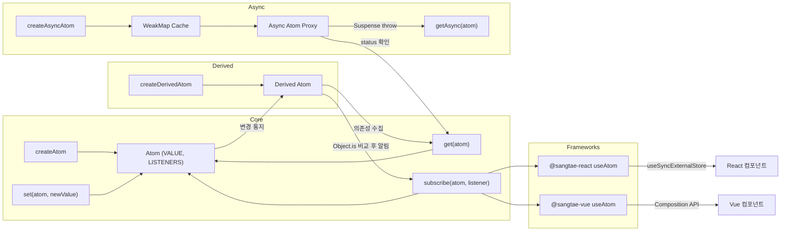
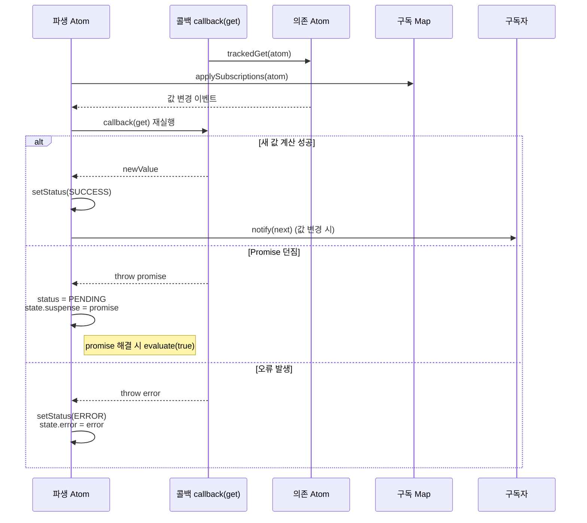
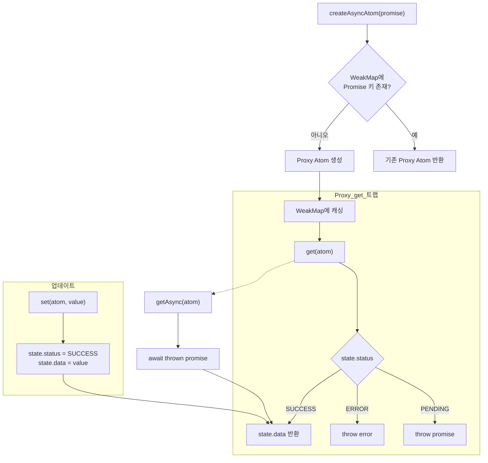

# DESIGN - 상태 관리 라이브러리 sangtae

## 1. 프로젝트 개요

- `sangtae-js`는 최소한의 API로 전역 상태, 파생 상태, 비동기 상태를 다룰 수 있는 경량 상태 관리 라이브러리입니다.
- `React`, `Vue` 등 framework 환경에서도 해당 API와 연동하여 동작합니다. `@sangtae-react`, `@sangtae-vue` 은 각 환경에서의 래핑 훅입니다.
- 모든 상태는 `Atom` 단위로 격리되고, framework 의존 없이도 `get`, `set`, `subscribe`만으로 동작하도록 설계했습니다.
- 선택 요구사항 중 파생 Atom, 비동기 Atom, GC 친화적인 구독 해제, 프레임워크 비종속 사용을 충족했습니다.

## 2. 제공 기능 요약

| 영역                 | 구현 현황 | 비고                                     |
| -------------------- | --------- | ---------------------------------------- |
| Atom 기본 API        | ✅        | `createAtom`, `get`, `set`, `subscribe`  |
| 파생 Atom            | ✅        | `createDerivedAtom`으로 자동 의존성 추적 |
| 비동기 Atom          | ✅        | `createAsyncAtom` + Suspense 대응        |
| React 연동           | ✅        | `useAtom` (useSyncExternalStore 기반)    |
| 메모리 관리          | ✅        | 마지막 구독 해지 시 Set 해제             |
| 배치 업데이트(React) | ✅        | React API 와 연동하여 구현               |

## 3. 시스템 구조 개요

- Atom은 내부적으로 값과 리스너 Set을 고유 Symbol 키로 숨기고 있습니다.
- 파생 Atom은 `callback(get)` 패턴으로 접근한 Atom을 추적하고 Map 기반으로 구독을 관리합니다. 평가 중 Promise를 던지면 Suspense 플로우를 유지하면서 상태를 `PENDING`으로 표시합니다.
- 비동기를 담은 Atom은 Promise 상태를 Proxy로 감싸 Suspense 패턴과 호환되도록 구성했으며, 동일 Promise에 대해 캐싱합니다.
- React 훅은 최소 의존으로 `useSyncExternalStore`를 통해 구독과 구독 해제, 배치 업데이트를 구현하였습니다.



## 4. Atom 내부 구조

### 4.1 내부 표현과 은닉화

- Atom은 `VALUE`, `LISTENERS` 두 개의 `Symbol` 키를 가진 객체로 표현됩니다.
- 외부에서는 `Atom<T>`를 `Readonly`로 노출하여 직접 수정이 불가능하고, 오직 제공된 API로만 접근합니다.

```ts
type InternalAtom<T> = {
  [VALUE]: T;
  [LISTENERS]: Set<Listener<T>> | null;
};
```

### 4.2 값 비교 최적화

- `set`과 파생 Atom 갱신은 `Object.is` 비교로 얕은 동등성을 검사합니다.
- 이 비교는 `NaN`과 `-0` 같은 edge case도 정확히 처리하고, 동일값 재설정에 따른 불필요한 렌더를 차단합니다.
- 파생 Atom 재계산 시에도 동일 비교를 통해 파생 값이 변하지 않으면 구독자에게 통지하지 않습니다.

### 4.3 구독과 GC 친화적 처리

- `subscribe`는 등록 시 즉시 값을 발행하지 않고, 이후 `set`이나 파생/비동기 Atom에서 값이 변할 때만 콜백을 호출합니다.
- 내부 `Set`은 중복 리스너를 허용하지 않고, 해지 시 빈 Set이면 `null`로 되돌려 GC 대상이 되도록 구성했습니다.

```ts
if (!Object.is(atom[VALUE], newValue)) {
  (atom as InternalAtom<T>)[VALUE] = newValue;
  atom[LISTENERS]?.forEach((listener) => listener(newValue));
}
...
if (currentListeners.size === 0) {
  (atom as InternalAtom<T>)[LISTENERS] = null;
}
```

### 4.4 메모리 관리

- 마지막 구독자가 빠지면 내부 리스너 Set을 `null`로 바꾸어 객체 레퍼런스를 해제하고 GC에 맡깁니다.
- 비동기 Atom의 캐시는 `WeakMap`을 사용하여 Promise 수명이 끝나면 자동으로 수거되도록 설계했습니다.

## 5. 파생 Atom 설계 (`createDerivedAtom`)

- 초기 생성 시 `callback(get)`을 실행하면서 접근한 Atom을 추적 `Set`에 담고, 기존 구독과 비교하여 Map으로 관리합니다.
- 각 의존 Atom을 `subscribe`하여 변경 시 `evaluate`를 재실행하고, 끊어진 의존성은 즉시 구독을 해제합니다.
- 평가 중 Promise가 던져지면 상태를 `PENDING`으로 두고 같은 Promise가 해결될 때까지 Suspense 플로우를 유지합니다. 해결되면 자동으로 재평가하고, 에러면 상태를 `ERROR`로 저장합니다.
- Proxy가 `VALUE` 접근을 가로채서 `PENDING`이면 Promise, `ERROR`면 에러를 throw하여 React Suspense나 try/catch에서 그대로 활용할 수 있습니다.
- 새 파생 값과 이전 값을 `Object.is`로 비교해 달라졌을 때만 리스너에게 알림을 보냅니다.
- 파생 Atom도 일반 Atom처럼 노출되므로 React/비 React 환경에서 동일 API를 사용할 수 있습니다.

```ts
const evaluate = (suppressErrors = false) => {
  const nextTrackedAtoms = new Set<Atom<unknown>>();
  const trackedGet = <U>(atom: Atom<U>) => {
    nextTrackedAtoms.add(atom as Atom<unknown>);
    return get(atom);
  };

  try {
    const newValue = callback(trackedGet);
    setStatus(ASYNC_ATOM_STATUS.SUCCESS);
    applySubscriptions(nextTrackedAtoms);

    if (!Object.is(derivedAtom[VALUE], newValue)) {
      derivedAtom[VALUE] = newValue;
      derivedAtom[LISTENERS]?.forEach((listener) => listener(newValue));
    }
  } catch (thrown) {
    applySubscriptions(nextTrackedAtoms);
    if (thrown instanceof Promise) {
      state.status = ASYNC_ATOM_STATUS.PENDING;
      state.suspense = thrown;
      thrown.then(() => {
        if (state.suspense === thrown) evaluate(true);
      });
      return;
    }
    setStatus(ASYNC_ATOM_STATUS.ERROR);
    state.error = thrown;
    if (!suppressErrors) throw thrown;
  }
};
```



## 6. 비동기 Atom 설계 (`createAsyncAtom`)

- 동일한 Promise로 여러 번 호출해도 하나의 Atom만 생성되도록 `WeakMap` 기반 캐시를 두었습니다.
- Promise 상태를 `pending/success/error`로 추적하면서 Proxy `get` 트랩에서 Suspense 규약에 맞추어 throw 하도록 구성했습니다.
- `set`으로 값을 교체하면 상태가 `success`로 전환되어 이미 resolve된 값 위에 동기 값을 덮어쓸 수 있습니다.
- `getAsync`는 내부적으로 `get`을 호출하고, `Promise`가 throw되면 `await`하여 값을 반환합니다.

```ts
const asyncAtomCache = new WeakMap<Promise<any>, Atom<any>>();
...
if (status === "pending") throw promise;
if (status === "error") throw error;
return data;
```



## 7. API 설계 및 사용 패턴

| 함수                          | 목적                  | 주요 설계 포인트                        |
| ----------------------------- | --------------------- | --------------------------------------- |
| `createAtom(initialValue)`    | 새로운 상태 단위 생성 | Symbol 키 기반 은닉, 초기엔 리스너 없음 |
| `get(atom)`                   | 현재 값 조회          | 단순 액세스, 비동기 Atom은 Proxy가 처리 |
| `set(atom, newValue)`         | 상태 갱신             | `Object.is` 비교 후 리스너 통지         |
| `subscribe(atom, callback)`   | 변경 감시             | 즉시 호출 + 해지 시 Set 정리            |
| `createDerivedAtom(callback)` | 파생 상태             | 의존성 자동 추적, Suspense/에러 전파    |
| `createAsyncAtom(promise)`    | 비동기 상태           | Promise 캐시, Suspense 대응             |
| `getAsync(atom)`              | 비동기 값 추출        | throw된 Promise/에러를 await 처리       |

## 8. React 연동 설계 (`@sangtae-react`)

- `useAtom`은 `useSyncExternalStore`를 사용하여 구독과 스냅샷을 안정적으로 관리합니다.
- 스토어 변경 알림은 `subscribe`가 제공하는 즉시 호출 덕분에 첫 렌더에서 값이 맞춰집니다.
- setter는 단순히 `set`을 감싼 콜백으로, 클로저 문제 없이 최신 Atom에 바인딩됩니다.

```1:20:@sangtae-react/src/index.ts
const value = useSyncExternalStore(subscribeAtom, getSnapshot, getSnapshot);
return [value, setValue];
```

### React 연동 시 직면했던 문제와 해결

- **문제 1: 메모이제이션 누락으로 구독 콜백 교체**  
  Atom을 props로 받는 컴포넌트에서 리렌더 시마다 구독 함수를 새로 만들어 구독/해제가 반복되었습니다. → `useCallback`으로 구독/스냅샷 함수를 Atom 의존성에 묶어 안정화했습니다.
- **문제 2: 파생 Atom 업데이트 루프**  
  파생 Atom이 자신을 의존 Atom으로 다시 참조하여 무한 루프가 생길 가능성이 있었습니다. → 파생 Atom 생성 시 의존 Atom Set을 고정하고, 재평가 시에는 `get`만 호출하도록 순환을 차단했습니다.
- **문제 3: createAsyncAtom 사용 한계**  
  비동기 아톰을 만드는것까지는 좋았으나 바닐라 환경에서 사용할 시 불편한 템플릿 코드가 반복되는 이슈가있었습니다. 설계의 한계라고 판단되어 getAsync 를 추가하여 사용성을 증대하였습니다.

## 9. Vue 연동 설계

- Composition API 기준 `useAtom` 헬퍼를 제공하면 Vue에서도 동일한 Atom을 재사용할 수 있습니다.
- React에서와 동일하게 `subscribe` 기반으로 상태를 동기화하되, Vue는 반응형 ref를 사용해 템플릿에 노출합니다.
- 라이프사이클 훅(`onMounted`, `onBeforeUnmount`)으로 구독 수명주기를 관리해 메모리 누수를 예방합니다.

```ts
// @sangtae-js 예시 - Vue용 useAtom
import { shallowRef, onMounted, onBeforeUnmount } from "vue";
import { Atom, get, subscribe } from "sangtae-js";

export function useAtom<T>(atom: Atom<T>) {
  const value = shallowRef(get(atom));
  let unsubscribe: (() => void) | undefined;

  onMounted(() => {
    unsubscribe = subscribe(atom, (next) => {
      value.value = next;
    });
  });

  onBeforeUnmount(() => {
    unsubscribe?.();
  });

  return value;
}
```

```ts
<script setup lang="ts">
import { createAtom, set } from "sangtae-js";
import { useAtom } from "./useAtom";

const counterAtom = createAtom(0);
const count = useAtom(counterAtom);

const increment = () => set(counterAtom, count.value + 1);
</script>

<template>
  <button @click="increment">클릭 횟수: {{ count }}</button>
</template>
```

- Vue 3의 `shallowRef`를 사용하면 Atom 값 변경 시 필요한 최소한의 반응성만 유지할 수 있습니다.
- 동일 Atom을 React/Vue 양쪽에서 공유할 수 있어 프레임워크 혼합 환경에서도 일관된 상태 관리가 가능합니다.

## 10. 성능 및 최적화 포인트

- `Object.is` 비교로 동일 값 재설정을 차단하여 불필요한 리렌더를 줄였습니다.
- 구독자 관리에 `Set`을 사용해 추가/삭제가 O(1)이고, 중복 등록도 예방했습니다.
- 비동기 Atom Proxy는 `get` 접근만 가로채서 다른 연산에는 비용이 들지 않도록 설계했습니다.
- 파생 Atom은 의존성을 `Set`으로 추적해 중복 구독을 방지하고, 의존 Atom 수가 많아도 선형 비용을 유지합니다.

## 11. 확장 가능성과 로드맵

- **디버깅 도구**: Atom 생성 시 이름을 옵션으로 받아 개발자 도구나 로깅에 활용하려고 합니다.
- **서버 컴포넌트 대응**: `createAsyncAtom`의 Suspense 대응을 기반으로 서버 액션과 결합하는 방식을 검토하고 있습니다.

## 12. 구현 중 문제와 해결

- **React 구독 콜백 재생성**  
  Atom을 props로 받을 때 컴포넌트가 리렌더되면서 매번 새로운 구독 함수를 생성해 구독/해제가 반복되는 비효율이 있었습니다. → `useCallback`으로 구독자/스냅샷 함수를 Atom 의존성에 묶어 메모이제이션했습니다.
- **파생 Atom 순환 참조 위험**  
  파생 Atom을 정의하는 콜백이 동일 파생 Atom을 다시 읽으면 무한 루프가 생길 수 있었습니다. → 파생 Atom 생성 시 의존 Atom Set을 초기화 단계에서 한 번만 구축하고, 이후 재평가에서는 `get` 호출만 허용해 순환을 차단했습니다.
- **비동기 Atom 중복 생성**  
  동일한 Promise로 여러 번 `createAsyncAtom`을 호출하면 불필요한 Atom이 생기고 캐시가 깨지는 문제가 있었습니다. → Promise를 키로 하는 `WeakMap` 캐시를 도입해 동일 Promise에 대해 항상 같은 Proxy Atom을 반환하도록 했습니다.
- **리스너 메모리 누수**  
  구독자가 해지된 뒤에도 내부 `Set`이 남아 있어 장기 실행 환경에서 메모리 누수가 우려되었습니다. → 마지막 구독자가 해지되면 `Set`을 `null`로 되돌려 GC가 참조를 정리할 수 있게 했습니다.
